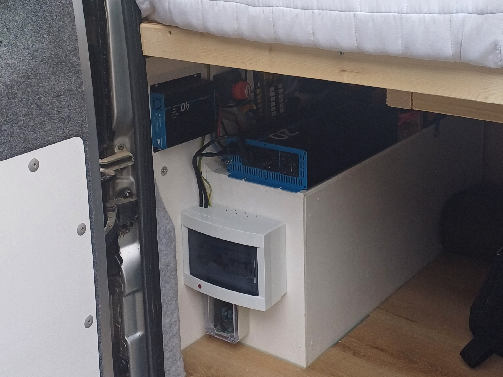

Maker Media GmbH

***

# Wohnmobil-Elektrik nach VDE

**Jeder, der ein Wohnmobil ausbaut, steht bei der 230-V-Elektroinstallation vor einer Herausforderung:** 
**Die Komponenten müssen richtig ausgewählt werden, im Verbund funktionieren und natürlich die** 
**Sicherheit gewährleisten. Dabei helfen u. a. die VDE-Normen. Doch selbst mit einem zunächst guten** 
**Plan können bei genauerer Betrachtung gefährliche Sicherheitslücken auftreten. Lesen Sie in diesem** 
**Artikel, was uns die Norm sagt, wo die Fallstricke liegen und wie man mit einer cleveren Umschaltbox** 
**Probleme und Sicherheitsrisiken vermeidet – natürlich auch in gekauften Wohnmobilen.**

 

Den vollständigen Artikel gibt es in der Make 5/25.
